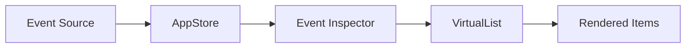
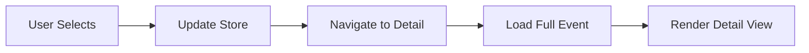

# Phase 2: Event Viewer Implementation

## Overview

The Event Viewer is the core feature of Cage's TUI, providing comprehensive inspection of all captured events from Claude Code hooks. It consists of two main components: the Event Inspector (list view) and Event Detail (detailed view).

## Event Data Structure

### Event Interface

```typescript
export interface Event {
  id: string;
  timestamp: string;
  eventType: string; // 'ToolUse', 'UserMessage', etc.
  sessionId: string;
  toolName?: string; // 'Read', 'Edit', 'Write', 'Bash', etc.
  arguments?: Record<string, unknown>;
  result?: Record<string, unknown>;
  error?: string;
  executionTime?: number;
}
```

### Event Types

- **ToolUse**: Tool invocation events (Read, Edit, Write, Bash, etc.)
- **UserMessage**: User prompts and inputs
- **AssistantMessage**: AI responses
- **SystemMessage**: System notifications
- **Error**: Error events and failures

## Event Inspector (List View)

### Features

The Event Inspector provides a sortable, filterable list of all events.

#### Display Columns

1. **Time**: Timestamp in HH:mm:ss.SSS format
2. **Type**: Event type (color-coded)
3. **Tool**: Tool name if applicable
4. **Description**: Brief description or prompt excerpt

#### Sorting Capabilities

- Timestamp (default, descending)
- Event type (alphabetical)
- Tool name (alphabetical)
- Session ID (grouped)

#### Filtering Options

- **By Type**: Filter to specific event types
- **By Tool**: Show only events for specific tools
- **By Session**: Focus on a particular session
- **By Date**: Events within date range
- **Search**: Full-text search across all event data

### Implementation Details

#### Virtual Scrolling

Uses the custom VirtualList component for performance:

```typescript
<VirtualList
  items={filteredEvents}
  height={listHeight}
  renderItem={renderEvent}
  onSelect={onSelectEvent}
  showScrollbar={true}
/>
```

#### Real-time Filtering

Filters are applied in real-time using memoization:

```typescript
const filteredEvents = useMemo(() => {
  let result = [...events];

  // Apply filters
  if (filter.value) {
    result = result.filter(event => {
      // Filter logic
    });
  }

  // Apply search
  if (searchQuery) {
    result = result.filter(event => {
      const searchableText = JSON.stringify(event).toLowerCase();
      return searchableText.includes(searchQuery.toLowerCase());
    });
  }

  // Sort
  result.sort((a, b) => {
    // Sorting logic
  });

  return result;
}, [events, filter, searchQuery, sortField, sortOrder]);
```

### Keyboard Shortcuts

| Key     | Action          | Description                 |
| ------- | --------------- | --------------------------- |
| `↑`/`↓` | Navigate        | Move selection up/down      |
| `j`/`k` | Vim navigate    | Alternative navigation      |
| `Enter` | View details    | Open event detail view      |
| `/`     | Search          | Start searching             |
| `f`     | Filter          | Cycle through filter fields |
| `F`     | Clear filters   | Reset all filters           |
| `t`     | Sort by time    | Sort by timestamp           |
| `y`     | Sort by type    | Sort by event type          |
| `o`     | Sort by tool    | Sort by tool name           |
| `s`     | Sort by session | Sort by session ID          |
| `r`     | Reverse         | Toggle sort order           |
| `ESC`   | Back            | Return to main menu         |

## Event Detail (Detailed View)

### Layout (Planned)

The Event Detail view will show comprehensive information about a selected event.

#### Header Section

- Event ID
- Timestamp (full ISO format)
- Event type with icon
- Session ID
- Execution time

#### Tabbed Content

1. **Arguments Tab**
   - Formatted JSON display
   - Syntax highlighting
   - Expandable nested objects

2. **Result Tab**
   - Output/result data
   - Success/failure status
   - Error messages if any

3. **Raw Tab**
   - Complete event JSON
   - Copy to clipboard option

#### Special Renderers

##### For Edit Events

- Old content vs new content
- Diff viewer with additions/deletions
- Line numbers and context

##### For Read Events

- File content display
- Syntax highlighting
- Line numbers

##### For Bash Events

- Command executed
- Output (stdout/stderr)
- Exit code

##### For Write Events

- File path
- Full content written
- Syntax highlighting

### Planned Features

#### Copy & Export

- Copy event JSON
- Copy specific fields
- Export to file
- Share via clipboard

#### Navigation

- Previous/Next event buttons
- Return to list
- Jump to related events

## Data Flow

### Event Loading



### Selection Flow



## Performance Optimizations

### List Performance

- **Virtual Scrolling**: Only render visible items
- **Memoization**: Cache filtered/sorted results
- **Debouncing**: Delay search/filter updates
- **Lazy Loading**: Load events in batches

### Memory Management

- **Event Limit**: Cap at 10,000 events in memory
- **Cleanup**: Remove old events periodically
- **Compression**: Store minimal data in list view

### Rendering Strategy

- **React.memo**: Prevent unnecessary re-renders
- **Key Extraction**: Efficient React keys
- **Shallow Comparison**: Optimize prop comparison

## Search Implementation

### Search Algorithm

```typescript
const searchEvents = (events: Event[], query: string): Event[] => {
  const lowercaseQuery = query.toLowerCase();

  return events.filter(event => {
    // Search in common fields
    if (event.id.toLowerCase().includes(lowercaseQuery)) return true;
    if (event.eventType.toLowerCase().includes(lowercaseQuery)) return true;
    if (event.toolName?.toLowerCase().includes(lowercaseQuery)) return true;

    // Deep search in arguments and results
    const eventStr = JSON.stringify(event).toLowerCase();
    return eventStr.includes(lowercaseQuery);
  });
};
```

### Search Optimizations

- Debounce input (300ms)
- Cache search results
- Progressive search (show partial results)
- Search indicators

## Filter Implementation

### Filter Types

```typescript
type FilterField = 'all' | 'type' | 'tool' | 'session' | 'date';

interface FilterState {
  field: FilterField;
  value: string;
}
```

### Multi-Filter Support (Planned)

```typescript
interface AdvancedFilters {
  types: string[];
  tools: string[];
  sessions: string[];
  dateRange: [Date, Date];
  hasError: boolean;
  minDuration?: number;
  maxDuration?: number;
}
```

## Testing Strategy

### Unit Tests

- Filter logic validation
- Sort algorithm correctness
- Search functionality
- Keyboard navigation

### Integration Tests

- Event selection flow
- Filter + sort combinations
- Navigation between views
- Data persistence

### Performance Tests

- Large dataset handling (10k+ events)
- Scroll performance
- Filter/sort speed
- Memory usage

## Future Enhancements

### Planned Features

1. **Advanced Filtering**
   - Multiple simultaneous filters
   - Filter presets
   - Save filter combinations

2. **Event Relationships**
   - Link related events
   - Show event chains
   - Timeline visualization

3. **Analytics**
   - Event frequency graphs
   - Tool usage statistics
   - Error rate tracking

4. **Export Options**
   - Export filtered results
   - Generate reports
   - CSV/JSON export

5. **Real-time Updates**
   - Live event streaming
   - Notification badges
   - Auto-refresh

## Accessibility

### Keyboard Support

- Full keyboard navigation
- No mouse required
- Vim-style bindings

### Screen Reader Support (Future)

- ARIA labels
- Navigation announcements
- Status updates

## Current Status

### Completed ✅

- Event Inspector component
- Virtual scrolling
- Sorting functionality
- Filtering system
- Search capability
- Keyboard navigation

### In Progress 🚧

- Event Detail view
- Tab interface
- Special renderers

### Planned ⏳

- Copy/Export features
- Advanced filtering
- Event relationships
- Analytics integration
