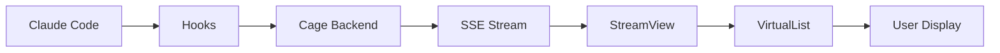

# Phase 2: Real-time Event Streaming

## Overview

The StreamView component provides real-time monitoring of events as they occur, with the ability to pause, inspect, and filter the stream. It connects to the Cage backend via Server-Sent Events (SSE) for low-latency updates.

## Architecture

### Data Flow


### SSE Connection

#### Client Setup (Planned)
```typescript
class SSEConnection {
  private eventSource: EventSource | null = null;
  private reconnectTimeout: NodeJS.Timeout | null = null;
  private reconnectDelay = 1000;
  private maxReconnectDelay = 30000;

  connect(url: string) {
    this.eventSource = new EventSource(url);

    this.eventSource.onopen = () => {
      console.log('SSE connected');
      this.reconnectDelay = 1000;
    };

    this.eventSource.onmessage = (event) => {
      const data = JSON.parse(event.data);
      useAppStore.getState().addEvent(data);
    };

    this.eventSource.onerror = () => {
      this.reconnect();
    };
  }

  private reconnect() {
    this.disconnect();

    this.reconnectTimeout = setTimeout(() => {
      this.connect(this.url);
      this.reconnectDelay = Math.min(
        this.reconnectDelay * 2,
        this.maxReconnectDelay
      );
    }, this.reconnectDelay);
  }

  disconnect() {
    this.eventSource?.close();
    this.eventSource = null;
    if (this.reconnectTimeout) {
      clearTimeout(this.reconnectTimeout);
    }
  }
}
```

## StreamView Component (Planned)

### Features

#### Real-time Display
- Events appear as they arrive
- Auto-scroll to newest
- Visual indication of new events
- Smooth animations

#### Pause/Resume
- Space bar to pause stream
- Buffer continues filling while paused
- Resume shows buffered events
- Clear buffer option

#### Split View
- List on left, detail on right
- Adjustable split ratio
- Synchronized scrolling
- Tab to switch focus

#### Filtering
- Apply filters in real-time
- Hide noise, focus on important events
- Filter presets for common scenarios

### Interface Design

```
┌─────────────────────────────────────────────────────────┐
│ REAL-TIME MONITOR - 🟢 Connected (42 events/min)       │
├─────────────────────────────────────────────────────────┤
│ Filters: [All Types] [All Tools] 🔍 Search...          │
├──────────────────────────┬──────────────────────────────┤
│ Time     Type    Tool    │ Event Details                │
│ ─────────────────────    │ ─────────────────────        │
│ 10:23:42 ToolUse Read  ▶ │ ID: evt-123                 │
│ 10:23:41 User    -       │ Tool: Read                  │
│ 10:23:40 ToolUse Edit    │ File: /src/app.ts           │
│ 10:23:39 System  -       │                             │
│ 10:23:38 ToolUse Write   │ Arguments:                  │
│ [PAUSED - 5 new events]  │ {                           │
│                          │   "file_path": "..."        │
│                          │   "limit": 100              │
│                          │ }                           │
├──────────────────────────┴──────────────────────────────┤
│ Space: Pause  Enter: Inspect  f: Filter  c: Clear       │
└─────────────────────────────────────────────────────────┘
```

### State Management

#### Stream State
```typescript
interface StreamState {
  isStreaming: boolean;
  isPaused: boolean;
  streamBuffer: Event[];
  newEventCount: number;
  eventsPerMinute: number;
  connectionStatus: 'connected' | 'disconnected' | 'reconnecting';
  lastEventTime: Date | null;
}
```

#### Buffer Management
```typescript
const MAX_BUFFER_SIZE = 1000;

const addToBuffer = (event: Event) => {
  const buffer = get().streamBuffer;

  if (buffer.length >= MAX_BUFFER_SIZE) {
    // Remove oldest events
    buffer.splice(0, buffer.length - MAX_BUFFER_SIZE + 1);
  }

  buffer.push(event);

  if (!get().isPaused) {
    // Update display immediately
    set({ streamBuffer: [...buffer] });
  } else {
    // Increment new event counter
    set({ newEventCount: get().newEventCount + 1 });
  }
};
```

## Performance Optimizations

### Rendering Strategy
- Virtual scrolling for large buffers
- Batch updates (max 60fps)
- Debounced re-renders
- Memoized event components

### Memory Management
- Circular buffer with max size
- Old events moved to disk
- Compressed event storage
- Lazy loading of details

### Network Optimization
- Compression (gzip)
- Binary protocol option
- Batch event sending
- Heartbeat for connection health

## Event Processing

### Event Enrichment
Events are enriched with metadata before display:

```typescript
interface EnrichedEvent extends Event {
  isNew: boolean;
  highlight: boolean;
  relatedEvents: string[];
  summary: string;
}

const enrichEvent = (event: Event): EnrichedEvent => {
  return {
    ...event,
    isNew: Date.now() - new Date(event.timestamp).getTime() < 1000,
    highlight: shouldHighlight(event),
    relatedEvents: findRelatedEvents(event),
    summary: generateSummary(event),
  };
};
```

### Event Highlighting
Certain events are highlighted for attention:

```typescript
const shouldHighlight = (event: Event): boolean => {
  // Highlight errors
  if (event.error) return true;

  // Highlight specific tools
  if (event.toolName === 'Write' || event.toolName === 'MultiEdit') {
    return true;
  }

  // Highlight long-running operations
  if (event.executionTime && event.executionTime > 5000) {
    return true;
  }

  return false;
};
```

## Filtering System

### Real-time Filters
Filters are applied to incoming events:

```typescript
const applyStreamFilter = (event: Event): boolean => {
  const filters = get().streamFilters;

  // Type filter
  if (filters.types.length > 0 && !filters.types.includes(event.eventType)) {
    return false;
  }

  // Tool filter
  if (filters.tools.length > 0 && !filters.tools.includes(event.toolName)) {
    return false;
  }

  // Error filter
  if (filters.errorsOnly && !event.error) {
    return false;
  }

  // Search filter
  if (filters.searchTerm) {
    const eventStr = JSON.stringify(event).toLowerCase();
    if (!eventStr.includes(filters.searchTerm.toLowerCase())) {
      return false;
    }
  }

  return true;
};
```

### Filter Presets
Common filter combinations:

```typescript
const filterPresets = {
  errors: {
    name: 'Errors Only',
    filters: { errorsOnly: true }
  },
  modifications: {
    name: 'File Changes',
    filters: { tools: ['Write', 'Edit', 'MultiEdit'] }
  },
  commands: {
    name: 'Commands',
    filters: { tools: ['Bash'] }
  },
  ai: {
    name: 'AI Messages',
    filters: { types: ['AssistantMessage', 'UserMessage'] }
  }
};
```

## Statistics & Metrics

### Real-time Metrics
Display live statistics about the stream:

```typescript
interface StreamMetrics {
  eventsPerMinute: number;
  averageProcessingTime: number;
  errorRate: number;
  topTools: Map<string, number>;
  eventTypesDistribution: Map<string, number>;
}

const calculateMetrics = (events: Event[]): StreamMetrics => {
  const now = Date.now();
  const oneMinuteAgo = now - 60000;

  const recentEvents = events.filter(e =>
    new Date(e.timestamp).getTime() > oneMinuteAgo
  );

  return {
    eventsPerMinute: recentEvents.length,
    averageProcessingTime: calculateAverage(
      recentEvents.map(e => e.executionTime || 0)
    ),
    errorRate: recentEvents.filter(e => e.error).length / recentEvents.length,
    topTools: groupBy(recentEvents, 'toolName'),
    eventTypesDistribution: groupBy(recentEvents, 'eventType'),
  };
};
```

## Testing Strategy

### Unit Tests
- SSE connection handling
- Reconnection logic
- Buffer management
- Filter application

### Integration Tests
- Stream pause/resume
- Event selection
- Split view interaction
- Filter combinations

### Performance Tests
- High-frequency events (100+ per second)
- Large buffers (1000+ events)
- Memory usage over time
- CPU usage during streaming

## Error Handling

### Connection Errors
```typescript
const handleConnectionError = (error: Error) => {
  console.error('SSE connection error:', error);

  // Update UI
  set({ connectionStatus: 'disconnected' });

  // Show user notification
  showNotification({
    type: 'error',
    message: 'Lost connection to server. Reconnecting...',
  });

  // Attempt reconnection
  scheduleReconnect();
};
```

### Data Errors
```typescript
const handleDataError = (data: unknown) => {
  console.error('Invalid event data:', data);

  // Log to debug console
  logDebug('Invalid event data received', data);

  // Continue streaming
  // Don't break the entire stream for one bad event
};
```

## Future Enhancements

### Planned Features

1. **Recording & Playback**
   - Record stream sessions
   - Playback at different speeds
   - Seek to specific times
   - Export recordings

2. **Advanced Filtering**
   - Regex patterns
   - Complex boolean logic
   - Filter templates
   - AI-powered filtering

3. **Alerting**
   - Set up alerts for specific events
   - Sound notifications
   - Desktop notifications
   - Email/webhook integration

4. **Multi-Stream Support**
   - Connect to multiple servers
   - Aggregate streams
   - Stream comparison
   - Stream synchronization

5. **Analytics Dashboard**
   - Real-time charts
   - Pattern detection
   - Anomaly detection
   - Predictive analytics

## Current Status

### Completed ✅
- Basic state management structure
- Mock event generation

### In Progress 🚧
- StreamView component design
- SSE connection implementation

### Planned ⏳
- Full StreamView implementation
- SSE client
- Real-time filtering
- Split view
- Metrics calculation
- Recording feature